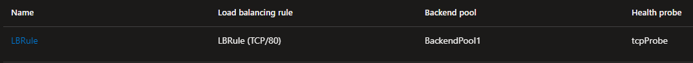

# Azure Gateway Load Balancer Service Chaining

<!-- TOC -->

- [Azure Gateway Load Balancer Service Chaining](#azure-gateway-load-balancer-service-chaining)
- [Introduction](#introduction)
- [Azure Networking native options](#azure-networking-native-options)
- [Enter Azure Gateway Load Balancer](#enter-azure-gateway-load-balancer)
- [Solution example (Palo Alto + HAProxy )](#solution-example-palo-alto--haproxy-)
    - [Before GWLB (HAProxy only)](#before-gwlb-haproxy-only)
        - [Overview](#overview)
        - [Traffic flow](#traffic-flow)
        - [Summary](#summary)
    - [After GWLB (Palo Alto + HAProxy)](#after-gwlb-palo-alto--haproxy)
        - [Overview](#overview)
        - [Build Palo Alto/GWLB layer](#build-palo-altogwlb-layer)
        - [Updated traffic flow](#updated-traffic-flow)
        - [Summary](#summary)
- [Additional reading](#additional-reading)

<!-- /TOC -->

# Introduction

A common pattern that customers investigate for Web Applications hosted on Azure is to force the ingress (Client to App) of traffic through multiple functional layers, often delineated as Firewall (With functions such as signature based IPS/IDS) and L7 Reverse Proxy (With functions such as L7 based load balancing and Web Application Firewall). This forcing of traffic through multiple functional blocks is often referred to as **Service Chaining**. This document describes a common use case for the Azure Gateway Load Balancer, whereby we are able to insert a layer of Firewall NVA prior to Reverse Proxy function, within a framework that aligns well to platform/app team governance, as well as preserving Client IP data for auditing purposes.

> Note, this article is written through the lens of _regional_ load balancing only. I.e. it assumes you have sent traffic to your chosen Azure region (E.g. West Europe) either because that is your only Azure Region, or you have already passed through a level of Global Load Balancing/Proxy (such as Azure Front Door or Azure Traffic Manager) that has selected this region as its chosen origin. 

# Azure Networking native options

[This](https://learn.microsoft.com/en-us/azure/architecture/example-scenario/gateway/application-gateway-before-azure-firewall) Azure public doc nicely lays out the rationale for making the decision around _"Do I even need multiple layers of inspection?_", therefore I will not repeat the logic here. Further more [this](https://learn.microsoft.com/en-us/azure/architecture/example-scenario/gateway/firewall-application-gateway) Azure public doc provides additional technical detail for layering Next Generation Firewall (IPS/IDS via Azure Firewall) and Web Application Firewall (WAF via Application Gateway) and discusses the pros and cons of the various possible topology combinations, when working with Azure-native networking tools.

After digesting the above content, a common pattern will often bubble to the surface wherein the [Application Gateway is placed before the Firewall](https://learn.microsoft.com/en-us/azure/architecture/example-scenario/gateway/firewall-application-gateway#application-gateway-before-firewall). This is generally selected for the following reasons:

- Allows Application Gateway to [insert X-forwarded-for](https://learn.microsoft.com/en-us/azure/application-gateway/how-application-gateway-works#modifications-to-the-request) headers. 
- Allows Azure Firewall (Premium) to perform a [subset of IDPS](https://learn.microsoft.com/en-us/azure/firewall/premium-features#:~:text=East%2DWest%20TLS%20Inspection%20(includes%20traffic%20that%20goes%20from/to%20an%20on%2Dpremises%20network)) protection as the traffic is sourced by the APGW Private IP after SNAT. 

Whilst providing some beneficial technical attributes, the above design pattern does pose some challenges if you have democratized the "reverse proxy" layer. I.e. if your Application Gateway's sit within Spokes (maybe even with [AKS integration](https://learn.microsoft.com/en-us/azure/application-gateway/ingress-controller-overview)). Another way of saying this; its complex/expensive/impractical to route traffic via a centralized IT-controlled Next-Gen Firewall if your WAF is not also controlled centrally.

# Enter Azure Gateway Load Balancer

Azure Gateway Load Balancer (GWLB) has been GA since July 2022, please check out the official [product page](https://learn.microsoft.com/en-us/azure/load-balancer/gateway-overview) to obtain the basic overview. 

The product page alludes to a unique benefit of GWLB "_Integrate virtual appliances transparently into the network path_" that can make our story around multi-layered Web security a little more flexible. In simple terms, we can use [VXLAN magic](https://learn.microsoft.com/en-us/azure/load-balancer/gateway-overview#:~:text=Balancer%20uses%20the-,VXLAN%20protocol.,-Benefits), to host our Firewall layer **first** within a completely isolated centrally-managed VNet, scrub the traffic (IPS/IDS etc), before handing it off to the application teams managing the reverse-proxy/WAF function. These teams receive the traffic as if it came straight from their client (no SNAT) and only have to make a [tiny change](https://learn.microsoft.com/en-us/azure/load-balancer/tutorial-gateway-portal#chain-load-balancer-frontend-to-the-gateway-load-balancer) to their own public facing Azure Load Balancer.


Notice how in the above description I am referring to the multiple layers as functional blocks "Firewall" and "WAF", this is where we need to call out some existing platform details.

- _Azure Firewall_ does not yet have support to fulfill the "Firewall" block in this architecture, I.e. you cannot leverage AZFW today as the GWLB backend. This is planned.
- _Application Gateway_ does not have support to fulfill the "WAF" block in this architecture, I.e. you cannot insert GWLB today prior to the APGW FrontEnd IP. This is planned. 

Therefore as of today, this article is aimed at those customers wishing to implement this pattern using third party appliances. Example vendors include:

- WAF & L7 reverse-proxy: _NGINX, F5, HAProxy, Kemp, etc_
- Firewall: _Palo Alto, Fortinet, Cisco, etc_

# Solution example (Palo Alto + HAProxy )

## Before GWLB (HAProxy only)

### Overview


### Traffic flow

- Client 92.237.232.141 starts connection to Web Service via DNS pointing ultimately to Frontend IP of SLB 20.107.98.166. Nothing special here, normal probe/rule/backend config, just make sure its SKU Standard ([or upgrade](https://learn.microsoft.com/en-us/azure/load-balancer/upgrade-basic-standard)).


- SLB maps this to Backend, representing two VMs running HAProxy (at this point you can do L7 routing, WAF, etc, depending on features/licensing of your chosen NVA)





- HAProxy VMs, that represent our layer of app-team-managed WAF/proxy both contain basic config in our lab that takes the inbound request, inserts XFF header, then polls the actual web-backend servers of 10.0.0.4 and 10.0.0.5 for reachability, before sending the traffic to one of them.

```
cat /etc/haproxy/haproxy.cfg
frontend http_front
   bind *:80
   default_backend http_back
backend http_back
   option forwardfor
   balance roundrobin
   server backend01 10.0.0.4:80 check
   server backend02 10.0.0.5:80 check
```

- Our backend web servers are both running basic Apache service, and we can verify an example received packet flow and XFF insertion via tcpdump/wireshark:


> Note. SRC = 10.0.0.6 = SNAT of HAProxy. DST = 10.0.0.4 = NIC of Web Server. XFF = Client.

### Summary

The App team has control over their own destiny (maybe the WAF policy that is pushed out to the Reverse-proxy is centrally managed), but they are free to add new front-ends etc. Traffic enters a via an Azure Standard Load Balancer in their VNet. The backend Web-Servers log requests that contain the XFF of the originating client.

## After GWLB (Palo Alto + HAProxy)

### Overview


### Build Palo Alto/GWLB layer

[This](https://docs.paloaltonetworks.com/vm-series/11-0/vm-series-deployment/set-up-the-vm-series-firewall-on-azure/deploy-the-vm-series-firewall-with-the-azure-gwlb) guide and ARM template can be used to build out the Palo Alto Firewall functional block. The main difference in our design (vs the linked Palo Alto scenario), is that the Standard ALB Frontend IP that we map to our GWLB is _not_ our application backend, but rather, the ALB that fronts our layer of HAProxy appliances. 

Note how the blue components are completely isolated from green, overlapping IP exist in my lab, and this is not an issue due to the transposition happening entirely within the layers of the Azure SDN below that of the customer VNet address space(s).

### Updated traffic flow

- Client 92.237.232.141 starts connection to Web Service via DNS pointing ultimately to Frontend IP of SLB 20.107.98.166. We have not had to modify our green config other than inserting the GWLB pointer within the green SLB Frontend IP config page.


- Traffic is now steered to our blue GWLB, and ultimately Palo Alto NVA 01 or 02, thanks to the basic backend/rule/probe config. The only interesting/new bit here, is the SKU being Gateway Load Balancer (rather than Standard), along with the VXLAN config within the BackendPool.


- This is where the Palo Alto NVA gets its chance to inspect/block/audit/log the traffic based on its centrally controlled configuration. We can login to he PAN-OS GUI and verify that we are able to allow/deny traffic destined to our Web Application, as well as log/inspect the traffic flows.


- If the Palo Alto Firewall layer allows the traffic, then the traffic egresses from the PA NVA via the VXLAN trust tunnel, returns via the unraveling of Blue GWLB to Green SLB to one of the HAProxy VMs. They receive the traffic sourced from 92.237.232.141 as if nothing happened, and ultimately pass this to the backend web farm as before.


> Notice how we did _not_ have to SNAT on the Palo Alto NVA to ensure flow return symmetry. This is another one of the bug selling points of Azure Gateway Load Balancer vs traditional NVA insertion designs (aka load balancer sandwich).

### Summary

The App team retains control over their own destiny (maybe the WAF policy that is pushed out to the Reverse-proxy is centrally managed), but they are free to add new front-ends etc. Traffic still enters a via an Azure Standard Load Balancer in their VNet. GWLB integration intercepts the packet and transparently steers this to a central managed layer of Palo Alto Firewalls that can perform NextGen functions, prior to passing back to the green WAF layer.

# Additional reading

- Jose Moreno published an excellent blog - [What language does the Azure Gateway Load Balancer speak?](https://blog.cloudtrooper.net/2021/11/11/what-language-does-the-azure-gateway-load-balancer-speak/) - where he goes deeper on the transport layer, and gives you the opportunity to "_become the NVA vendor_" with his Linux based NVA (and associated AZ CLI scripts).

